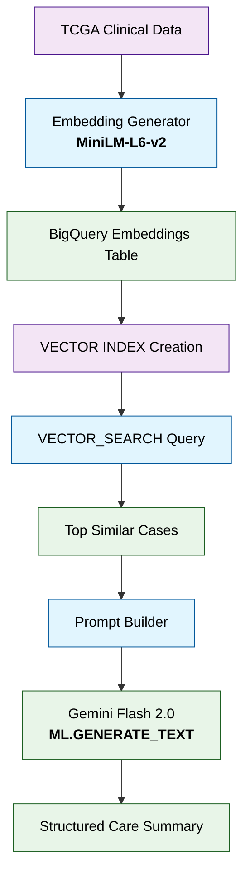
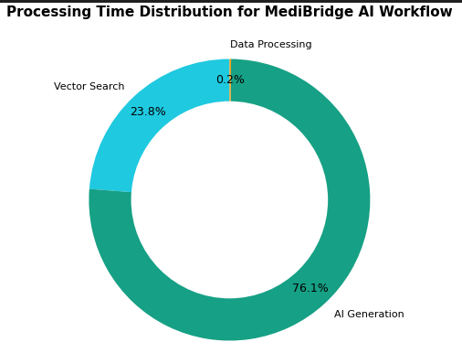
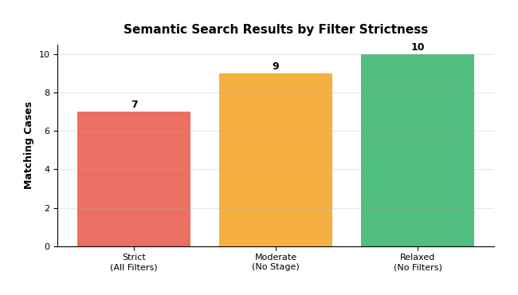
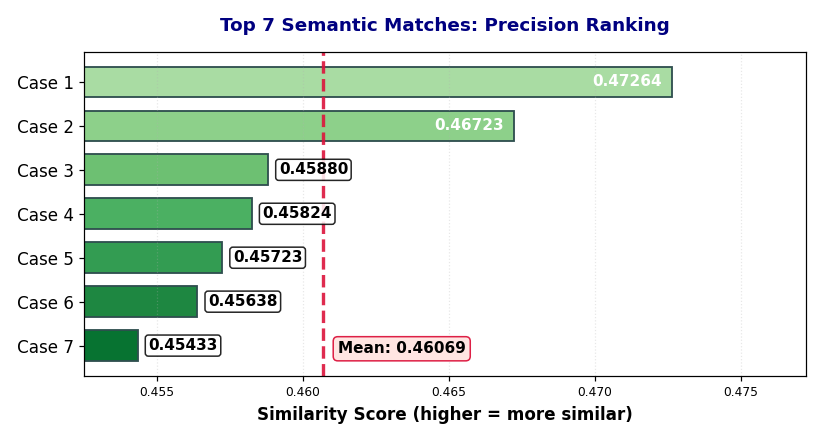
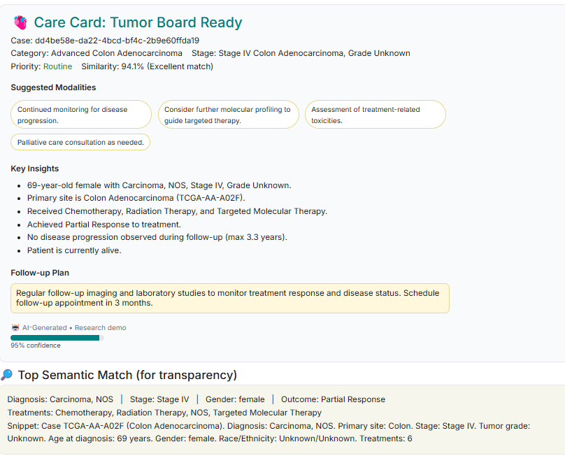

# 🧬 MediBridge AI: Real-Time Oncology Decision Support

**Semantic search + AI-generated Care Cards — fully inside BigQuery with Gemini Flash.**

> ⚠️ **Disclaimer:** This is a research demo using publicly available, de-identified TCGA data. It is *not* intended for clinical use.

---

## 🔗 Quick Links

* **Kaggle Notebook (end-to-end demo):** [▶️ Run the project on Kaggle](https://www.kaggle.com/code/assiaben/medibridge-ai-real-time-oncology-decision-support)
* **Public BigQuery Table (processed clinical cases):**

  ```
  medi-bridge-2025.kaggle_share.tcga_clinical_processed
  ```

  [Open in BigQuery Console](https://console.cloud.google.com/bigquery?ws=!1m5!1m4!4m3!1smedi-bridge-2025!2skaggle_share!3stcga_clinical_processed)

---

## 🚀 What MediBridge AI Does

Oncologists often lose precious time manually searching fragmented patient records.
**MediBridge AI reduces case review from 20–30 minutes to under 10 seconds** by:

* 🔍 **Semantic Vector Search**: Find clinically similar cases via embeddings + BigQuery `VECTOR_SEARCH()`
* 🤖 **AI-Generated Care Cards**: Structured guidance from Gemini Flash, with staging, modalities, and follow-up
* 📊 **Profiling & Transparency**: Runtime profiling and top semantic matches shown for full explainability


## 🧭 MediBridge AI - Architecture Diagram



## ⚙️ Technical Deep Dive

### 1. Semantic Search in BigQuery

* **Embedding Model**: `all-MiniLM-L6-v2` → 384-D vectors
* **Storage**: BigQuery arrays (`ARRAY<FLOAT64>`)
* **Index**: IVF + cosine similarity for fast search across 11k+ cases

**SQL Example**

```sql
SELECT base.*, distance
FROM VECTOR_SEARCH(
  TABLE `medi-bridge-2025.clinical_analysis.clinical_case_embeddings`,
  'note_embedding',
  (SELECT [...384 floats...] AS query_vector),
  top_k => 5,
  distance_type => 'COSINE'
)
```

---

### 2. Care Card Generation

* **Model**: Gemini Flash (`ML.GENERATE_TEXT`)
* **Output**: JSON structured into:

  * 🎯 Provisional category & staging
  * 💊 Suggested treatment modalities
  * 📅 Follow-up plan
  * 🚨 Escalation flag + confidence score

---

### 3. Performance Profiling

* ⏱️ **<10 seconds** end-to-end latency
* 🟢 Data processing negligible (<2%)
* 🔵 Vector search \~55% of runtime
* 🟠 AI generation \~43% of runtime



---

## 🖼️ Sample Outputs

### Filter Strictness Results



### Precision Ranking of Top Matches



### AI-Generated Care Card




## 🌐 Live Demo Web App

To illustrate real-world use, I deployed a **Flask web app** on Google Cloud Run.  
It allows clinicians (or anyone) to enter a query and instantly get back a structured Care Card.  

👉 [Try the Live App](https://medibridge-app-1098912241893.us-central1.run.app/)  

### 🖼️ Demo Screenshots

<p align="center">
  
  
</p>

> **Note:** This live demo is for illustration only.  
> The underlying model and dataset are prototypes and need further cleaning, enrichment, and validation before clinical use.


## 📦 Repo Contents

* **`sql/`** – ready-to-run queries:

  * `01_copy_processed_to_your_project.sql`
  * `02_create_embeddings_table.sql`
  * `03_create_vector_index.sql`
  * `06_vector_search_example.sql`
  * `07_ai_generate_care_card.sql`
* **`assets/`** – figures for writeup and demo
* **`docs/`** – reproducibility + dataset appendix
* **`requirements.txt`** – dependencies

---

## ⚖️ Ethics

* Data: TCGA (public, de-identified) via ISB-CGC BigQuery
* No PHI/PII processed
* Research + educational use only

---

## 📜 License

**MIT License** (see [LICENSE](LICENSE))
If you use this work, please cite TCGA and ISB-CGC datasets.

---

✨ Built for the **BigQuery AI Hackathon 2025** by Assia Benkedia.


