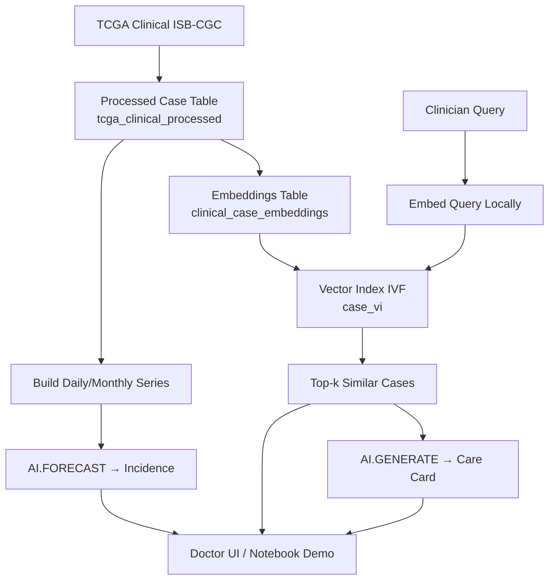
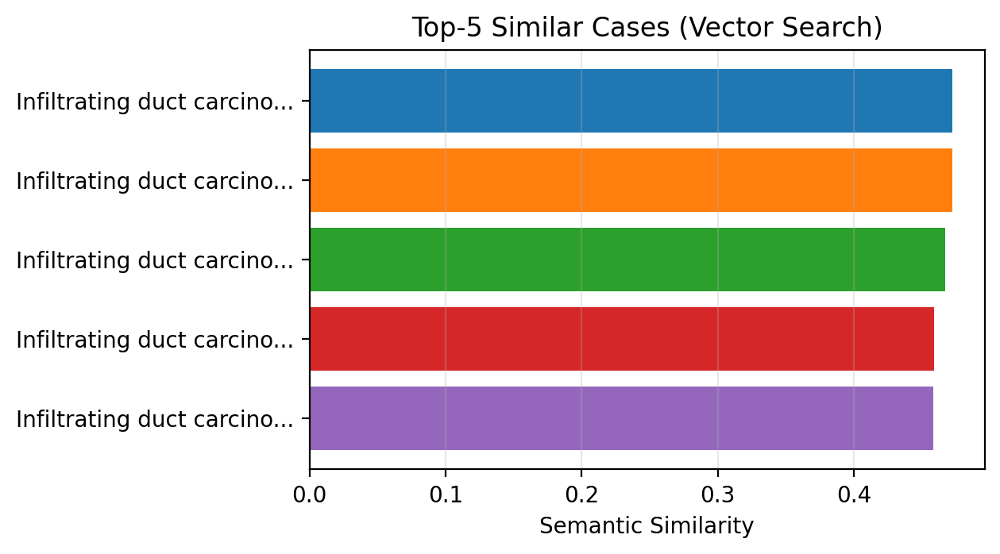
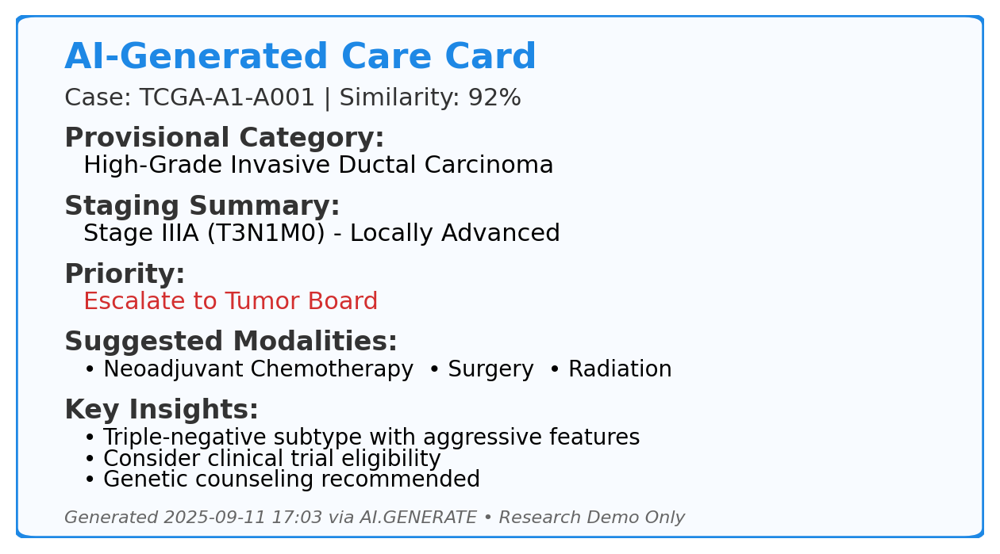
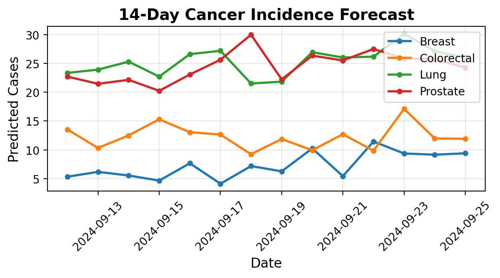
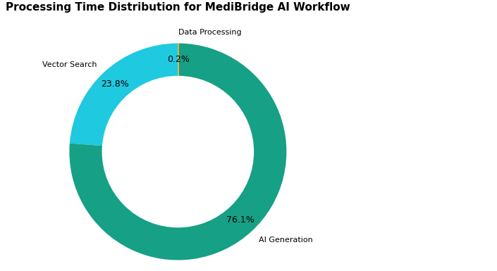

# 🧬 MediBridge AI: Clinical Decision Support (BigQuery AI)

Semantic search over TCGA clinical notes, AI-generated Care Cards, and incidence forecasting — all **inside BigQuery**.

> **Disclaimer:** Research demo using public TCGA data (de-identified). Not a medical device. Do **not** use for clinical decisions.

---

## 🔗 Quick Links

- **Kaggle Notebook (demo pipeline):** [ADD_YOUR_KAGGLE_LINK_HERE]
- **Public BigQuery table (processed clinical cases):**  
  ```
  medi-bridge-2025.kaggle_share.tcga_clinical_processed
  ```
  [Open in Console](https://console.cloud.google.com/bigquery?ws=!1m5!1m4!4m3!1smedi-bridge-2025!2skaggle_share!3stcga_clinical_processed)

---

## ⚡ Quickstart (2 min)
1) BigQuery → run `sql/01_copy_processed_to_your_project.sql` (replace `YOUR_PROJECT`).
2) Run `sql/02_create_embeddings_table.sql` (schema stub). Populate embeddings via the Kaggle notebook.
3) Run `sql/03_create_vector_index.sql`.
4) Try: [Semantic search](#-run-a-semantic-search-in-bigquery) or [Forecast](#-forecast-daily-incidence).


## 🚀 What this repo contains

- **`docs/DATA_APPENDIX.md`** — Full dataset details, schema, lineage, and example queries  
- **`docs/REPRODUCIBILITY.md`** — End-to-end steps to run the pipeline in your own GCP project  
- **`assets/`** — Figures for the writeup (semantic results, care card, forecasts, architecture)

---

## 🏗️ Pipeline (BigQuery-native)



---
## 🔎 Run a semantic search in BigQuery
Use our ready script to find **top-k similar cases** with the vector index.

**Files**
- `sql/06_vector_search_example.sql` — paste-and-run query  
- `assets/sample_query_embedding_minilm.txt` — 384-D embedding for the demo (MiniLM-L6-v2)

**Steps**
1. BigQuery Console → **Compose new query**.
2. Paste `sql/06_vector_search_example.sql`.
3. Replace `YOUR_PROJECT` with your project id.
4. At `/* <PASTE_384_FLOATS_HERE> */` paste the single line from `assets/sample_query_embedding_minilm.txt`.
5. **Run** → returns top-k similar cases (COSINE).


## 📈 Forecast daily incidence
- Build daily series: run `sql/04_build_case_daily.sql`
- Forecast 14 days: run `sql/05_forecast_daily.sql`

---

## 📦 Data Appendix (summary)

**Table (public, read-only):**
```
medi-bridge-2025.kaggle_share.tcga_clinical_processed
```

- **Rows:** ~11,428 (one per case_id)
- **Source:** TCGA clinical (ISB-CGC BigQuery public datasets), consolidated for ML/LLM use.

### Key Columns (subset)

| Field | Type | What it's for |
|-------|------|---------------|
| `case_id` | STRING | Row key |
| `submitter_id` | STRING | TCGA submitter ID |
| `disease_category` | STRING | Canonical cancer group |
| `primary_site` | STRING | Site of origin |
| `diag__primary_diagnosis` | STRING | Primary diagnosis text |
| `diag__ajcc_pathologic_stage` | STRING | AJCC stage (if present) |
| `treatment_types` | STRING | Modalities received |
| `treatment_outcomes` | STRING | Outcome / response |
| `age_group` | STRING | Derived bucket |
| `gender` | STRING | Reported gender |
| `vital_status` | STRING | Vital at last follow-up |
| `clinical_note` | STRING | Cleaned narrative used for embeddings/LLMs |

### Try it

```sql
-- Count
SELECT COUNT(*) AS n
FROM `medi-bridge-2025.kaggle_share.tcga_clinical_processed`;

-- Peek
SELECT case_id, disease_category, diag__primary_diagnosis,
       diag__ajcc_pathologic_stage,
       SUBSTR(clinical_note, 1, 180) AS note_snippet
FROM `medi-bridge-2025.kaggle_share.tcga_clinical_processed`
LIMIT 5;
```

**Full schema + lineage SQL:** see [`docs/DATA_APPENDIX.md`](docs/DATA_APPENDIX.md).

---

## 🔒 Reproducibility (IAM & Auth)

**Service Account (runner):**
- BigQuery Job User (project)
- BigQuery Data Viewer (source datasets)
- BigQuery Data Editor (target datasets)  
- BigQuery Connection User on `us.llm_connection`
- Grant Vertex AI User to the connection's service account

**Kaggle/Colab secret:** `GCP_SECRET_KEY` (full SA JSON).

See [`docs/REPRODUCIBILITY.md`](docs/REPRODUCIBILITY.md) for exact steps and CLI.

---

## 📈 Outputs (tables created by the notebook)

- **`clinical_case_embeddings`** — vectors + metadata
- **`case_vi`** — vector index (IVF, COSINE)  
- **`clinical_ai_guidance`** — Care Card (AI.GENERATE or deterministic fallback)
- **`case_daily`, `case_monthly`** — time series for AI.FORECAST
- **`tumor_board_summaries`** — 5-bullet summaries

---

## 🖼️ Sample Results

### Semantic Search


### AI-Generated Care Card  


### Incidence Forecasting


### Processing Time Distribution


---

## ⚖️ Ethics

- Public, de-identified TCGA data; no PHI/PII processed here.
- Research demo only; not validated for clinical use.

---

## 📜 License / Citation

**License:** MIT (see [LICENSE](LICENSE))

**Cite:** The Cancer Genome Atlas (TCGA) program; ISB-CGC public BigQuery datasets.

---

*For full details on data processing, schema, and step-by-step reproduction, see the docs folder.*
