# 🧬 MediBridge AI: Clinical Decision Support (BigQuery AI)

Semantic search over TCGA clinical notes, AI-generated Care Cards, and incidence forecasting — all **inside BigQuery**.

> **Disclaimer:** Research demo using public TCGA data (de-identified). Not a medical device. Do **not** use for clinical decisions.

---

## 🔗 Quick Links

- **Kaggle Notebook (demo pipeline):** [ADD_YOUR_KAGGLE_LINK_HERE]
- **Public BigQuery table (processed clinical cases):**  
  ```
  medi-bridge-2025.kaggle_share.tcga_clinical_processed
  ```
  [Open in Console](https://console.cloud.google.com/bigquery?ws=!1m5!1m4!4m3!1smedi-bridge-2025!2skaggle_share!3stcga_clinical_processed)

---

## 🚀 What this repo contains

- **`docs/DATA_APPENDIX.md`** — Full dataset details, schema, lineage, and example queries  
- **`docs/REPRODUCIBILITY.md`** — End-to-end steps to run the pipeline in your own GCP project  
- **`assets/`** — Figures for the writeup (semantic results, care card, forecasts, architecture)

---

## 🏗️ Pipeline (BigQuery-native)

```mermaid
graph TD
  A[TCGA Clinical ISB-CGC] --> C[Processed Case Table<br/>tcga_clinical_processed]
  C --> E[Embeddings Table<br/>clinical_case_embeddings]
  E --> I[Vector Index IVF<br/>case_vi]
  Q[Clinician Query] --> QE[Embed Query Locally]
  QE --> I
  I --> K[Top-k Similar Cases]
  K --> G[AI.GENERATE → Care Card]
  C --> S[Build Daily/Monthly Series]
  S --> F[AI.FORECAST → Incidence]
  G --> D[Doctor UI / Notebook Demo]
  F --> D
  K --> D
```



---

## 📦 Data Appendix (summary)

**Table (public, read-only):**
```
medi-bridge-2025.kaggle_share.tcga_clinical_processed
```

- **Rows:** ~11,428 (one per case_id)
- **Source:** TCGA clinical (ISB-CGC BigQuery public datasets), consolidated for ML/LLM use.

### Key Columns (subset)

| Field | Type | What it's for |
|-------|------|---------------|
| `case_id` | STRING | Row key |
| `submitter_id` | STRING | TCGA submitter ID |
| `disease_category` | STRING | Canonical cancer group |
| `primary_site` | STRING | Site of origin |
| `diag__primary_diagnosis` | STRING | Primary diagnosis text |
| `diag__ajcc_pathologic_stage` | STRING | AJCC stage (if present) |
| `treatment_types` | STRING | Modalities received |
| `treatment_outcomes` | STRING | Outcome / response |
| `age_group` | STRING | Derived bucket |
| `gender` | STRING | Reported gender |
| `vital_status` | STRING | Vital at last follow-up |
| `clinical_note` | STRING | Cleaned narrative used for embeddings/LLMs |

### Try it

```sql
-- Count
SELECT COUNT(*) AS n
FROM `medi-bridge-2025.kaggle_share.tcga_clinical_processed`;

-- Peek
SELECT case_id, disease_category, diag__primary_diagnosis,
       diag__ajcc_pathologic_stage,
       SUBSTR(clinical_note, 1, 180) AS note_snippet
FROM `medi-bridge-2025.kaggle_share.tcga_clinical_processed`
LIMIT 5;
```

**Full schema + lineage SQL:** see [`docs/DATA_APPENDIX.md`](docs/DATA_APPENDIX.md).

---

## 🔒 Reproducibility (IAM & Auth)

**Service Account (runner):**
- BigQuery Job User (project)
- BigQuery Data Viewer (source datasets)
- BigQuery Data Editor (target datasets)  
- BigQuery Connection User on `us.llm_connection`
- Grant Vertex AI User to the connection's service account

**Kaggle/Colab secret:** `GCP_SECRET_KEY` (full SA JSON).

See [`docs/REPRODUCIBILITY.md`](docs/REPRODUCIBILITY.md) for exact steps and CLI.

---

## 📈 Outputs (tables created by the notebook)

- **`clinical_case_embeddings`** — vectors + metadata
- **`case_vi`** — vector index (IVF, COSINE)  
- **`clinical_ai_guidance`** — Care Card (AI.GENERATE or deterministic fallback)
- **`case_daily`, `case_monthly`** — time series for AI.FORECAST
- **`tumor_board_summaries`** — 5-bullet summaries

---

## 🖼️ Sample Results

### Semantic Search


### AI-Generated Care Card  


### Incidence Forecasting


### Processing Time Distribution


---

## ⚖️ Ethics

- Public, de-identified TCGA data; no PHI/PII processed here.
- Research demo only; not validated for clinical use.

---

## 📜 License / Citation

**License:** Apache-2.0

**Cite:** The Cancer Genome Atlas (TCGA) program; ISB-CGC public BigQuery datasets.

---

*For full details on data processing, schema, and step-by-step reproduction, see the docs folder.*
